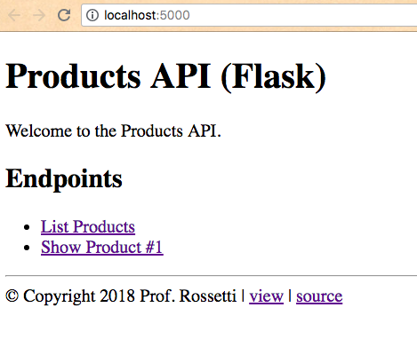
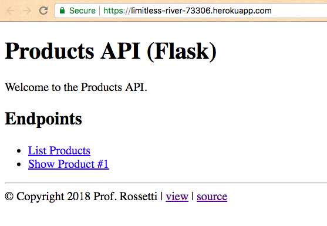
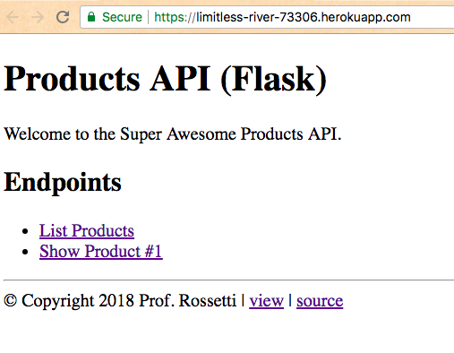

# Deploying to Production

> Prerequisites: [Heroku](/notes/hardware/heroku.md) (sign up for a account, install the Heroku CLI, and login via the command line).

## Objectives

This exercise provides students with a hands-on opportunity to deliver software for public consumption over the Internet.

## Instructions

The software we will deploy in this exercise is the [Products API](https://github.com/prof-rossetti/products-api-flask), a web application built with [the `flask` package](/notes/programming-languages/python/packages/flask.md).



> NOTE: This application has already been prepared for deployment to a Heroku server. There are a few steps you need to take before deploying your own application, primarily adding certain files to your repository. For example, adding a `requirements.txt` or `Pipenv` file will specify which packages should be installed onto the server, and a `Procfile` will specify which processes the server should run. If you are interested in deploying your own Python application to Heroku but aren't sure how to prepare it, ask the professor, who would be happy to help you out!

### Setup

Fork the [Products API](https://github.com/prof-rossetti/products-api-flask) repository to create a copy of the source code under the control of your own GitHub account.

Then use your Git client of choice to download ("clone") your forked repository, perhaps onto your Desktop, and finally navigate there from the command-line:

```sh
cd Desktop/

git clone https://github.com/YOUR_GITHUB_USERNAME/products-api-flask.git # where YOUR_GITHUB_USERNAME is your GitHub username
#> Cloning into 'products-api-flask'...
#> remote: Counting objects: 391, done.
#> remote: Compressing objects: 100% (24/24), done.
#> remote: Total 391 (delta 11), reused 18 (delta 6), pack-reused 361
#> Receiving objects: 100% (391/391), 61.54 KiB | 0 bytes/s, done.
#> Resolving deltas: 100% (215/215), done.

cd products-api-flask/
```

At this time, when you view the remote addresses associated with this local repository, you will only see only one address (called "origin"), pointing to your fork on GitHub:

```sh
git remote -v
#> origin	https://github.com/YOUR_GITHUB_USERNAME/products-api-flask.git (fetch)
#> origin	https://github.com/YOUR_GITHUB_USERNAME/products-api-flask.git (push)
```

OK great, let's get to the fun part!

### Provisioning a Heroku Server

In addition to the existing remote address called "origin", we will be associating the local repository with another remote address called "heroku", which will point to a server provided by Heroku.

Run the following command to associate your local repository with a new Heroku remote address:

```sh
# from the repository's root directory:
heroku create
#> Creating app... done, ⬢ limitless-river-73306
#> https://limitless-river-73306.herokuapp.com/ | https://git.heroku.com/limitless-river-73306.git
```

> NOTE: your application's name will be different.

To verify this worked, let's check the local repository's remote addresses again:

```sh
# from the repository's root directory:
git remote -v
#> heroku	https://git.heroku.com/limitless-river-73306.git (fetch)
#> heroku	https://git.heroku.com/limitless-river-73306.git (push)
#> origin	https://github.com/YOUR_GITHUB_USERNAME/products-api-flask.git (fetch)
#> origin	https://github.com/YOUR_GITHUB_USERNAME/products-api-flask.git (push)
```

Now we see the second remote address named "heroku" has been configured. In the same way we are able to upload and download the repository to and from its GitHub address, we can also upload the repository to its Heroku address.

### Deploying to Heroku Server

As long as the server has been provisioned properly, you should be able to run the following command to "deploy" the application's source code there:

```sh
git push heroku master # where "heroku" is the name of the remote address to deploy to, and "master" is the name of the branch (or version) to deploy there
#> Counting objects: 52, done.
#> Delta compression using up to 4 threads.
#> Compressing objects: 100% (37/37), done.
#> Writing objects: 100% (52/52), 14.54 KiB | 0 bytes/s, done.
#> Total 52 (delta 13), reused 38 (delta 9)
#> remote: Compressing source files... done.
#> remote: Building source:
#> remote:
#> remote: -----> Python app detected
#> remote: -----> Installing python-3.6.5
#> remote: -----> Installing pip
#> remote: -----> Installing dependencies with Pipenv 11.8.2…
#> remote:        Installing dependencies from Pipfile.lock (fe6343)…
#> remote:        Ignoring appnope: markers 'sys_platform == "darwin"' don't match your environment
#> remote: -----> Discovering process types
#> remote:        Procfile declares types -> web
#> remote:
#> remote: -----> Compressing...
#> remote:        Done: 57.5M
#> remote: -----> Launching...
#> remote:        Released v3
#> remote:        https://limitless-river-73306.herokuapp.com/ deployed to Heroku
#> remote:
#> remote: Verifying deploy... done.
#> To https://git.heroku.com/limitless-river-73306.git
#>  * [new branch]      master -> master
```

At this time, when you try to revisit the application's URL in a browser, you should see it functioning at that address, available for public consumption and usage:




Nice job!

## Further Exploration

Try revising the application's source code, for example by opening the `products_api/templates/index.html` file in your text editor and changing `<p>Welcome to the Products API.</p>` to `<p>Welcome to the Super Awesome Products API.</p>`.

After saving and committing your changes, re-deploy the source code to Heroku, and you will see the changes reflected online at the Heroku server's remote address:



